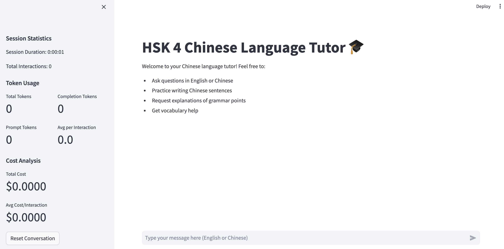

# HSK 4 Chinese Language Tutor 🎓



A Streamlit-based Chinese language learning assistant that uses OpenAI's GPT-4 to provide interactive Chinese language tutoring at the HSK 4 level.

## Features

- Interactive chat interface with GPT-4
- Real-time Chinese corrections and explanations
- Pinyin and English translations for all responses
- Token usage and cost tracking
- HSK 4 level vocabulary and grammar focus
- Detailed learning explanations and tips

## Prerequisites

- Python 3.8 or higher
- OpenAI API key
- Git (for cloning the repository)

## Installation

1. Clone the repository:
```bash
git clone https://github.com/yourusername/chinese-tutor.git
cd chinese-tutor
```

2. Create and activate a virtual environment:
```bash
# For Windows
python -m venv venv
.\venv\Scripts\activate

# For macOS/Linux
python3 -m venv venv
source venv/bin/activate
```

3. Install required packages:
```bash
pip install -r requirements.txt
```

4. Create a `.env` file in the project root and add your OpenAI API key:
```
OPENAI_API_KEY=your-api-key-here
```

## Usage

1. Start the application:
```bash
streamlit run chinese_tutor_app.py
```

2. Open your web browser and navigate to the URL shown in the terminal (typically http://localhost:8501)

3. Begin interacting with the tutor by typing in English or Chinese

## File Structure

```
chinese-tutor/
├── README.md
├── requirements.txt
├── chinese_tutor_app.py
├── .env
└── images/
    └── chinese_tutor_interface.png
```

## Features in Detail

### Chat Interface
- Natural conversation flow
- Support for both English and Chinese input
- Structured responses with Chinese characters, pinyin, and translations

### Language Learning
- HSK 4 vocabulary integration
- Grammar pattern examples and explanations
- Instant corrections for Chinese writing
- Learning tips and mnemonics

### Cost Tracking
- Real-time token usage monitoring
- Cost per interaction display
- Session statistics tracking
- Detailed usage analytics

## Contributing

1. Fork the repository
2. Create your feature branch (`git checkout -b feature/AmazingFeature`)
3. Commit your changes (`git commit -m 'Add some AmazingFeature'`)
4. Push to the branch (`git push origin feature/AmazingFeature`)
5. Open a Pull Request

## License

This project is licensed under the MIT License - see the LICENSE file for details.

## Acknowledgments

- OpenAI for providing the GPT-4 API
- Streamlit for the web interface framework
- LangChain for LLM integration tools


